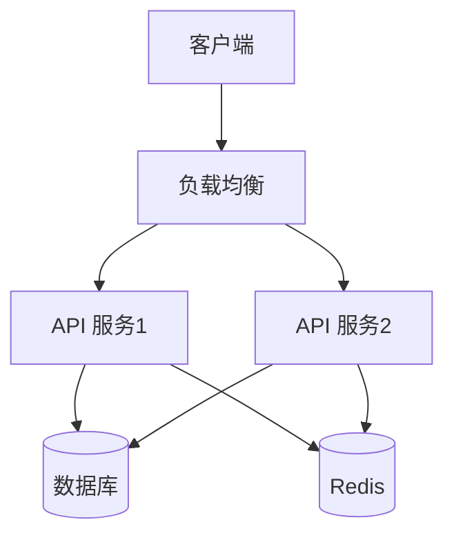
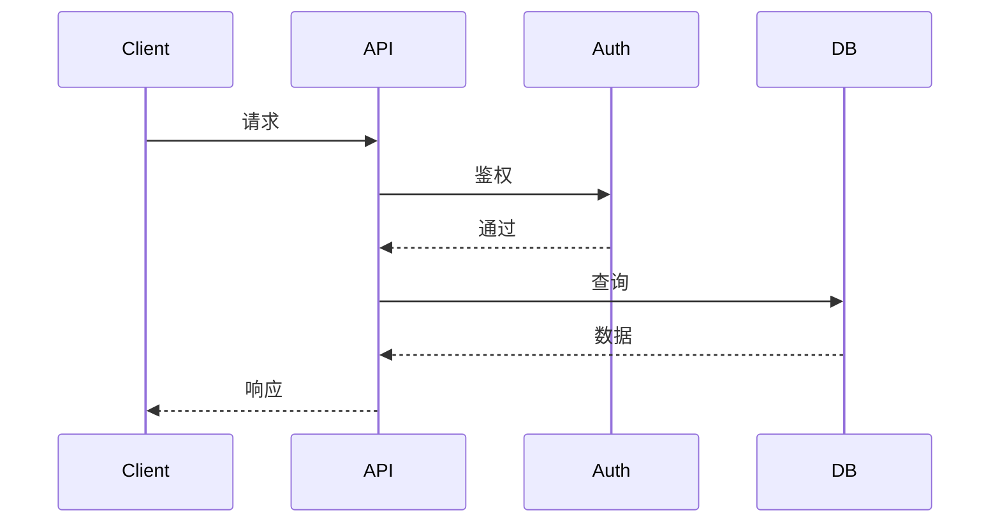
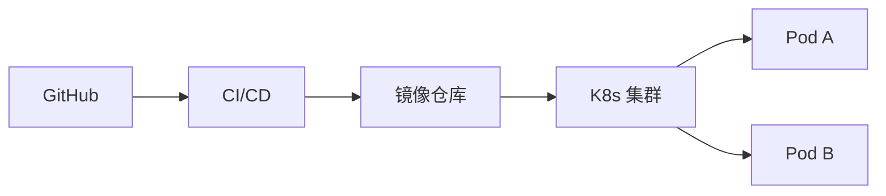
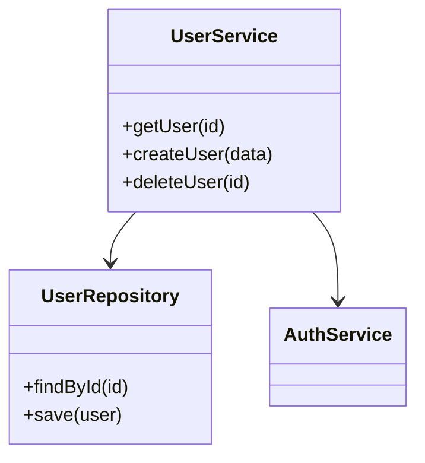
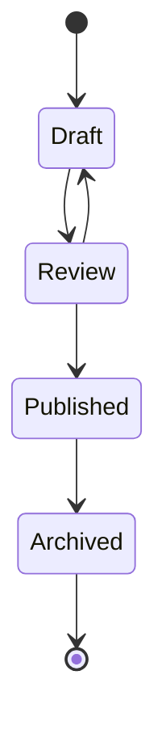

# Mermaid 架构图模板

## 系统架构图

```mermaid
graph TB
    Client[客户端] --> LB[负载均衡]
    LB --> API1[API 服务1]
    LB --> API2[API 服务2]
    API1 --> DB[(数据库)]
    API2 --> DB
    API1 --> Cache[(Redis)]
    API2 --> Cache
```

## 数据流图

```mermaid
sequenceDiagram
    Client->>API: 请求
    API->>Auth: 鉴权
    Auth-->>API: 通过
    API->>DB: 查询
    DB-->>API: 数据
    API-->>Client: 响应
```

## 部署架构

```mermaid
graph LR
    GH[GitHub] --> CI[CI/CD]
    CI --> Reg[镜像仓库]
    Reg --> K8s[K8s 集群]
    K8s --> Pod1[Pod A]
    K8s --> Pod2[Pod B]
```

## 类图

```mermaid
classDiagram
    UserService --> UserRepository
    UserService --> AuthService
    
    class UserService {
        +getUser(id)
        +createUser(data)
        +deleteUser(id)
    }
    class UserRepository {
        +findById(id)
        +save(user)
    }
```

## 状态机

```mermaid
stateDiagram-v2
    [*] --> Draft
    Draft --> Review
    Review --> Published
    Review --> Draft
    Published --> Archived
    Archived --> [*]
```

使用方式: 根据需要选择合适的模板，填入实际组件名后放到 README 或设计文档中。
